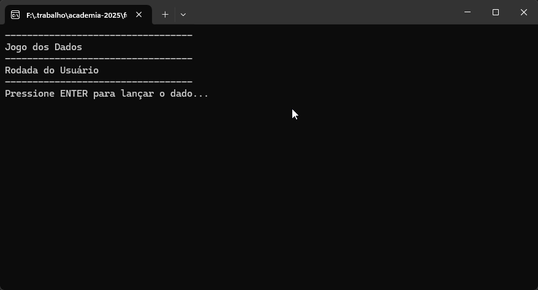

# Jogo dos Dados 2026!



## Introdução  
O Jogo dos Dados é um jogo simples baseado em turnos, onde o jogador compete contra o computador para ver quem alcança primeiro a linha de chegada. O jogo implementa eventos especiais que podem acelerar ou retardar o progresso dos participantes.

---

## Regras do Jogo  

- O jogo ocorre em uma pista com um limite de 30 casas.  
- O jogador e o computador jogam alternadamente.  
- A cada turno, um dado é sorteado (valores entre 1 e 6) para determinar o avanço.  

### Eventos especiais  

- **Avanço extra (+3 casas)**  
  - Posições: 5, 10, 15, 25  

- **Recuo (-2 casas)**  
  - Posições: 7, 13, 20  

- O primeiro a alcançar ou ultrapassar a linha de chegada vence.

---

 ## Como utilizar o programa
 
 1. Clone o repositório ou baixe o código comprimido em .zip.
 2. Abra o emulador de terminal e navegue até a pasta raiz.
 3. Utilize o 'comando' abaixo para restaurar as dependencias do projeto.

 ```
 dotnet restore
 ```

 4. Em seguida compile e execute o projeto com o comando:

 ```
 dotnet run --project CalculadoraConsoleApp
 ````
 ## Requisitos
 - .NET SDK 10.0
